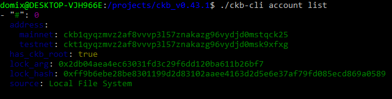
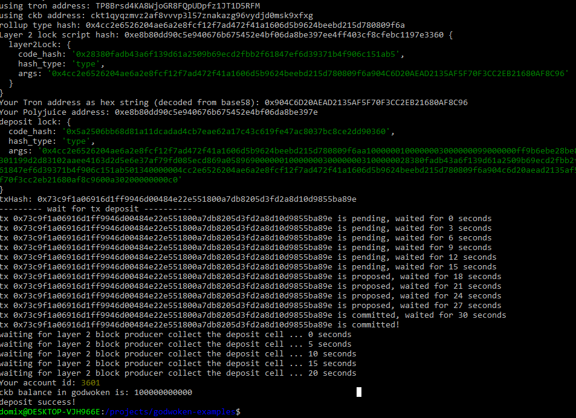
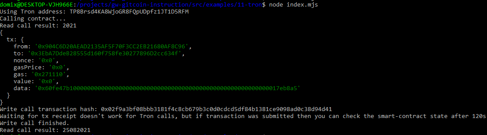

# Task 11

## Account list


## A link to the Layer 1 address you funded on the Testnet Explorer
https://explorer.nervos.org/aggron/address/ckt1qyqzmvz2af8vvvp3l57znakazg96vydjd0msk9xfxg

## Deposit


## Contract call


## Contract write call tx
0x02f9a3bf08bbb3181f4c8cb679b3c0d0cdcd5df84b1381ce9098ad0c38d94d41

## Contract address
0x3EbA7DdeB28555d160f758fe30277896D2cc634f

## ABI
```
[
    {
      "inputs": [],
      "stateMutability": "payable",
      "type": "constructor"
    },
    {
      "inputs": [
        {
          "internalType": "uint256",
          "name": "x",
          "type": "uint256"
        }
      ],
      "name": "set",
      "outputs": [],
      "stateMutability": "payable",
      "type": "function"
    },
    {
      "inputs": [],
      "name": "get",
      "outputs": [
        {
          "internalType": "uint256",
          "name": "",
          "type": "uint256"
        }
      ],
      "stateMutability": "view",
      "type": "function"
    }
]
```

## Tron address
TP8Brsd4KA8WjoGR8FQpUDpfz1JT1D5RFM