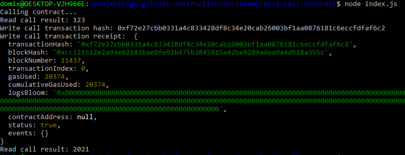

Task 3

call

tx hash: 0xf72e27cbb0331a4c833428df8c34e20cab26003bf1aa0876181c6eccfdfaf6c2

called contract address: 0x3EbA7DdeB28555d160f758fe30277896D2cc634f

ABI

[
    {
      "inputs": [],
      "stateMutability": "payable",
      "type": "constructor"
    },
    {
      "inputs": [
        {
          "internalType": "uint256",
          "name": "x",
          "type": "uint256"
        }
      ],
      "name": "set",
      "outputs": [],
      "stateMutability": "payable",
      "type": "function"
    },
    {
      "inputs": [],
      "name": "get",
      "outputs": [
        {
          "internalType": "uint256",
          "name": "",
          "type": "uint256"
        }
      ],
      "stateMutability": "view",
      "type": "function"
    }
  ]