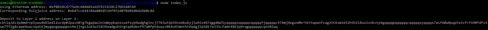

# Task 6

## Receiving layer 2 deposit address

## Deposit address
ckt1q3dz2p4mdrvp5ywu4kk5edl2uc4p03puvx07g7kgqdau3n3dmypkqnxzuefxyp9wdghglncj77k5wt6p59sx6kukyjlwh5s467qgp8m25yqqqqqsqqqqqvqqqqqfjqqqqqc976mj4egun0krtkttwpwnfzag25t6sm3d32h5h2l8un2snkvny6gqqqqpqqqqqqcqqqqqxyqqqqx7asf60w8pqpte2sfcfn90fdfzxue7ff2g8sawe9wacnqat6jmygqngqqqqpxv9ejjvgz2u63w3l839aadguh5rgtqd4devf97a0fpt4uqsz0k4u93mntht6wdgj5p58t7e335cfamt486jq9rqgqqqqqqcqnt0lwq

## Ethereum address
0xf0B1DCd775e9cd44A81a1D7ECC634C27bb5d4FA9

## Etherscan Force Bridge transaction
https://rinkeby.etherscan.io/tx/0x543706c6f226bead534661f7d63611bd69dc7b33dc6fc3eb37692c9b3bea98e1

## Nervos Force Bridge transaction
https://explorer.nervos.org/aggron/transaction/0x2c67fe3302825bea8fe4eec09bd1974acfa86bf478e603bda08e6c312ba04488
